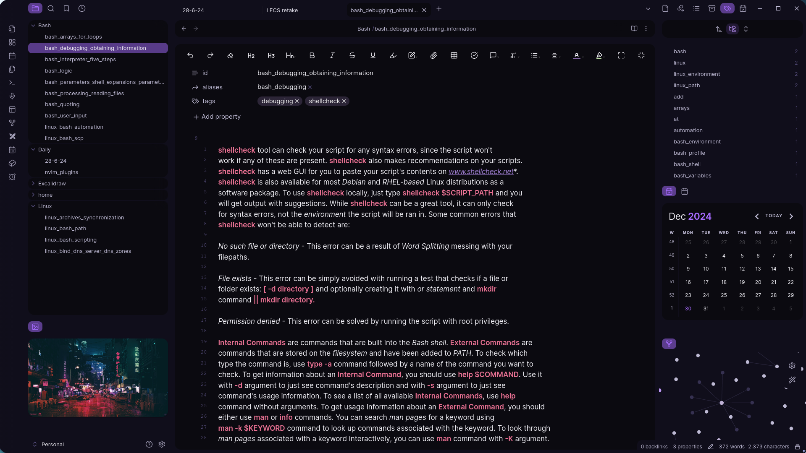

Here's my Obsidian configuration that I use for both work-related and personal notes. Works cross-platform, just copy all the files folder into your Obsidian Vault location. I consider it minimalistic, yet very functional to track tasks and notes. Enjoy!

